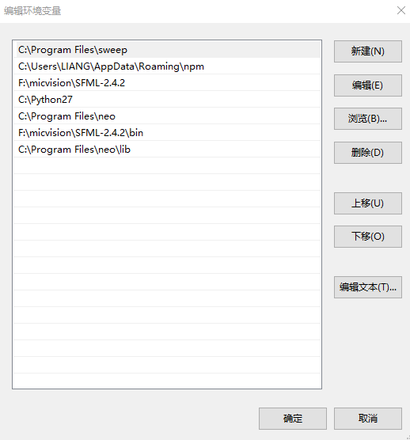
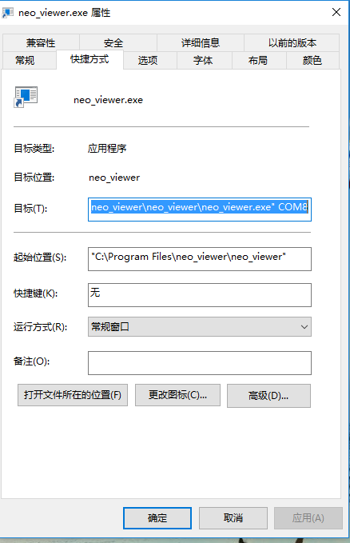

neo viewer demo
===
This repo make a demo to show neo lidar.

# ENVIRONMENT
1. Windows:
	`Win10, Visual Studio 14 2015 Win64`
2. Linux:
    `Ubuntu 16.04, gcc 5.4.0`
# INSTALL
1. Dependency
   * [CMake](http://www.cmake.org)
     - Windows: download and install cmake
     - Linux: ```sudo apt-get install cmake-gui```
   * [SFML 2](http://www.sfml-dev.org)
     - Windows:
       + download a precompiled version of SFML and place wherever you want(like: F:\micvision\SFML-2.4.2)
       + adding SFML to system environment variable PATH: `F:\micvision\SFML-2.4.2`, `F:\micvision\SFML-2.4.2\bin`
     - Linux: ```sudo apt-get install libsfml-dev```
   * [neo-sdk](http://www.github.com/micvision/neo-sdk)
     - See the readme file to install it.
     - Windows: Adding neo to environment PATH: `C:\Program Files\neo`, `C:\Program Files\neo\lib`
     

2. Generate the build configuration
   1. Start cmake-gui
   2. In the field "Where is the source code", choose the directory containing this readme.md file.
   3. In the field "Where to build the binaries" ,choose a path where you want the code to be generated.
   4. Click "Configure" and choose your compiler
   5. Choose your build configuration by setting CMAKE_BUILD_TYPE(Release or Debug)
   6. In Windows, check the box next to SFML_STATIC_LIBRARIES if you want to link SFML statically. Leave it unchecked if you prefer linking SFML dynamically and using DLL file.
   7. Set the CMAKE_INSTALL_PREFIX to the path where you want the executables of the book's code to be installed.
   8. Click again "Configure"
   9. Click "Generate".

3. Compile the source code
   1. Change the directory to the build directory.
   2. Now to compile the code.

       For Linux. In the terminal, run:
       ```
       make
       sudo make install
       ```
       For Window, you should see a .sln solution. Open it and build it(with administrator privileges to install)
   3. You should see the executables and media files in CMAKE_INSTALL_PREFIX.

# USAGE
1. Linux
```./neo_viewer /dev/ttyACM0```
You should change the serial port to the right one on your computer.

2. Windows
make a shortcut on desktop, and change the property like below:


you should change the `COM8` to the right serial port on your computer. And click the shortcut to run the program.